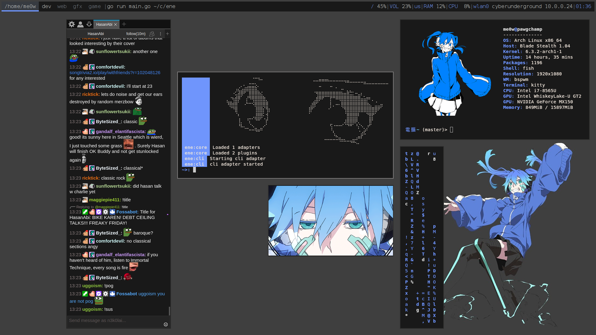

# 鱼 [](https://github.com/hlissner/doom-emacs) [](https://nixos.org)

Crazy? I Was Crazy Once. They Locked Me In A Room. A Rubber Room. A Rubber Room With Nix. And Nix Makes Me Crazy. Heavily inspod by [hlissner](https://github.com/hlissner/dotfiles/tree/master)

|                |                                 |
|----------------|---------------------------------|
| **Shell:**     | fish                            |
| **DM:**        | lightdm + lightdm-mini-greeter  |
| **WM:**        | hyprland                        |
| **Editor:**    | [Doom Emacs][doom-emacs]        |
| **Terminal:**  | foot                            |
| **Launcher:**  | wofi                            |
| **Browser:**   | opera                           |
| **GTK Theme:** | dracula                         |

install:
   ```sh
   nix-shell -p git nixFlakes

   # Set HOST to the desired hostname of this system
   HOST=...
   # Set USER to your desired username (defaults to hlissner)
   USER=...

   git clone https://github.com/n3k0lai/dotfiles /etc/dotfiles
   cd /etc/dotfiles
   
   # Create a host config in `hosts/` and add it to the repo:
   mkdir -p hosts/$HOST
   nixos-generate-config --root /mnt --dir /etc/dotfiles/hosts/$HOST
   rm -f hosts/$HOST/configuration.nix
   cp hosts/ren/default.nix hosts/$HOST/default.nix
   vim hosts/$HOST/default.nix  # configure this for your system; don't use it verbatim!
   git add hosts/$HOST
   
   # Install nixOS
   USER=$USER nixos-install --root /mnt --impure --flake .#$HOST
   
   # If you get 'unrecognized option: --impure', replace '--impure' with 
   # `--option pure-eval no`.

   # Then move the dotfiles to the mounted drive!
   mv /etc/dotfiles /mnt/etc/dotfiles
   ```

# NIX TODO
* wtf is nix dawg idk
  - [ ] [A three-part tweag article that everyone's read.](https://www.tweag.io/blog/2020-05-25-flakes/)
  - [ ] [An overengineered config to scare off beginners.](https://github.com/divnix/devos)
  - [ ] [A minimalistic config for scared beginners.](https://github.com/colemickens/nixos-flake-example)
  - [ ] [A nixos wiki page that spells out the format of flake.nix.](https://nixos.wiki/wiki/Flakes)
  - [ ] [Official documentation that nobody reads.](https://nixos.org/learn.html)
  - [ ] [Some great videos on general nixOS tooling and hackery.](https://www.youtube.com/channel/UC-cY3DcYladGdFQWIKL90SQ)
  - [ ] A couple flake configs that I 
    [may](https://github.com/LEXUGE/nixos) 
    [have](https://github.com/bqv/nixrc)
    [shamelessly](https://git.sr.ht/~dunklecat/nixos-config/tree)
    [rummaged](https://github.com/utdemir/dotfiles)
    [through](https://github.com/purcell/dotfiles).
   - [ ] [Some notes about using Nix](https://github.com/justinwoo/nix-shorts)
  - [ ] [What helped me figure out generators (for npm, yarn, python and haskell)](https://myme.no/posts/2020-01-26-nixos-for-development.html)
  - [ ] [Learn from someone else's descent into madness; this journals his
    experience digging into the NixOS
    ecosystem](https://www.ianthehenry.com/posts/how-to-learn-nix/introduction/)
  - [ ] [What y'all will need when Nix drives you to drink.](https://www.youtube.com/watch?v=Eni9PPPPBpg)
* UI
  - [ ] add back x11
  - [ ] finish waybar
    - [ ] move config to hypr
    - [ ] style icons
    - [ ] fps
    - [ ] ping
  - [ ] wofi compositor
  - [ ] fish functions in wofi
  - [ ] fcitx theme
  - [ ] notification daemon
  - [ ] wayland lockscreen
* audio
  - [ ] ncmpcpp
  - [ ] keybboard hotkeys
  - [ ] spotify/soundcloud
* dev
  - [ ] doom emacs
* common
  - [ ] file manager
  - [ ] wifi manager
  - [x] rdp
  - [ ] mv public to usr/share

my old x11 look


[doom-emacs]: https://github.com/hlissner/doom-emacs
[nixos]: https://releases.nixos.org/?prefix=nixos/unstable/