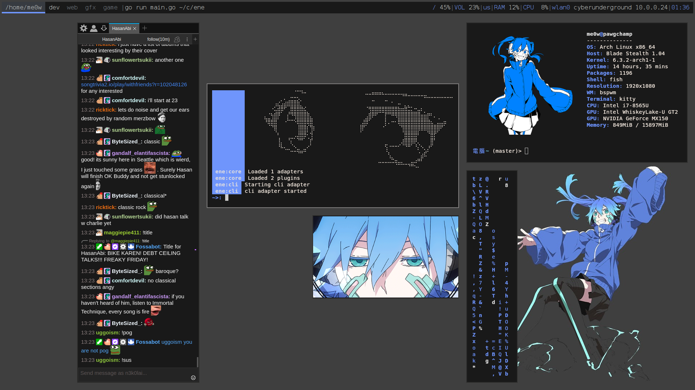

# 鱼
These are my dotfiles. Main focus is on fish, hyprland, and dev tools

# TODO
* UI
  - [x] clean out x11
  - [ ] finish waybar
    - [ ] move config to hypr
    - [ ] style icons
    - [ ] fps
    - [ ] ping
  - [ ] wofi compositor
  - [ ] fish functions in wofi
  - [ ] fcitx theme
  - [ ] notification daemon
  - [ ] wayland lockscreen
* audio
  - [ ] ncmpcpp
  - [ ] keybboard hotkeys
  - [ ] spotify/soundcloud
* dev
  - [ ] doom emacs
* common
  - [ ] file manager
  - [ ] wifi manager
  - [x] rdp
  - [ ] mv public to usr/share

my old x11 look

